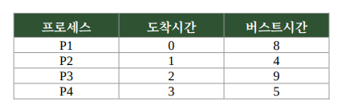

# 문제 08 — SRT 스케줄링 평균 대기시간

## 문제

다음 프로세스들을 SRT(Shortest Remaining Time) 스케줄링으로 처리할 때 평균 대기시간을 구하시오. (단위: ms)

## 정답

6.5ms

<strong>상세 해설</strong>

## 핵심 개념

SRT는 선점형 SJF다. 새 프로세스가 도착할 때마다 준비 상태 프로세스 중 남은 실행 시간이 가장 짧은 프로세스가 CPU를 사용한다.

## 문제 풀이

실행 순서는 P1(0–1), P2(1–5), P4(5–10), P1(10–17), P3(17–26)이다. 대기시간은 P1=9, P2=0, P3=15, P4=2ms다. 평균은 (9+0+15+2)÷4=6.5ms다.

## 오답 및 혼동 포인트

P2가 1ms에 도착했을 때 P1의 남은 시간은 7ms이고 P2는 4ms이므로 P1을 선점한다. 도착 시점과 실행 완료 시점을 함께 고려하지 않고 단순히 버스트시간만 비교하면 평균 대기시간을 잘못 구한다.

## 암기 포인트

각 프로세스 대기시간은 완료시각 − 도착시각 − 버스트시간으로 계산해 평균한다.

---
