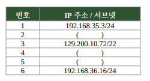

# 문제 10 — 서브넷별 IP 주소 판별

## 문제

네트워크 A, B, C에 속한 호스트 IP 주소 목록이다. 괄호에 들어갈 수 있는 IP 주소를 각각 하나씩 쓰시오.

<strong>정답 보기</strong>

2. 192.168.35.72
4. 129.200.8.249
5. 192.168.36.249

<strong>상세 해설</strong>

## 핵심 개념

IPv4 주소가 같은 네트워크에 속하는지는 IP 주소와 프리픽스 길이(서브넷 마스크)가 정한다. 호스트 주소는 해당 서브넷의 네트워크·브로드캐스트 주소를 피해야 한다.

## 문제 풀이

1번 `192.168.35.3/24`와 같은 A 네트워크는 `192.168.35.0/24`이므로 2번에 `192.168.35.72`를 쓸 수 있다. 3번 `129.200.10.72/22`는 `129.200.8.0/22`에 속하므로 4번은 `129.200.8.249`가 가능하다. 6번 `192.168.36.16/24`와 같은 C 네트워크에서 5번은 `192.168.36.249`로 쓸 수 있다.

## 오답 및 혼동 포인트

`/22`는 세 번째 옥텟을 4씩 묶어 8–11이 한 네트워크가 된다. `/24`는 앞의 세 옥텟이 네트워크 부분이다. 주소를 고를 때 서브넷이 다른 주소를 섞거나 네트워크 주소·브로드캐스트 주소를 쓰지 않는다.

## 암기 포인트

`/24`는 마지막 옥텟이 호스트 부분이고, `/22`는 세 번째 옥텟의 블록 크기가 4다.

---
