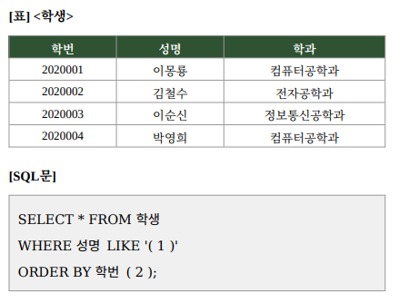

# 문제 12

## 문제

다음 학생 테이블에서 성이 ‘이’씨인 학생의 정보를 조회하고, 학번 기준 내림차순으로 정렬하려 한다. SQL 빈칸에 들어갈 내용을 쓰시오.

<strong>정답 보기</strong>

1. 이%
2. DESC

<strong>상세 해설</strong>

## 핵심 개념

SQL `LIKE`에서 `%`는 뒤에 임의 길이의 문자열이 오는 것을 뜻한다. `ORDER BY`의 `DESC`는 내림차순 정렬을 지정한다.

## 문제 풀이

성명이 ‘이’로 시작하는 행을 찾으려면 `성명 LIKE '이%'`를 사용한다. 학번 내림차순은 `ORDER BY 학번 DESC`로 작성한다.

## 오답 및 혼동 포인트

`'이_'`는 뒤에 한 글자만 허용하므로 이름 길이가 다양한 경우 조건에 맞지 않는다. `ASC`는 오름차순이므로 문제의 정렬 방향과 반대다.

## 암기 포인트

LIKE의 `%`는 여러 문자, `_`는 한 문자이며 DESC는 내림차순이다.

---
