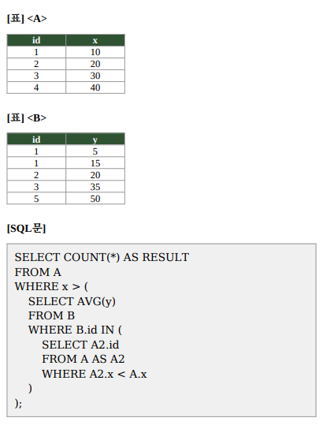

# 문제 13 — 상관 서브쿼리와 집계 결과

## 문제

다음 A·B 테이블과 SQL문을 보고 RESULT 값을 구하시오.

## 정답

3

<strong>상세 해설</strong>

## 핵심 개념

상관 서브쿼리는 바깥 쿼리의 행 값(A.x)을 참조해 안쪽 쿼리를 반복 평가한다. `AVG`는 조건에 맞는 값의 평균을 반환하고, 조건에 맞는 행이 없으면 NULL이 된다.

## 문제 풀이

A의 각 행을 살펴보면 id=1, x=10일 때 더 작은 x를 가진 A 행이 없으므로 안쪽 집합이 비어 평균은 NULL이고 비교 결과는 참이 아니다. x=20, 30, 40인 행은 각각 자신보다 작은 x를 가진 A 행의 id를 이용해 B 값을 선택하고, 선택된 값의 평균보다 커서 참이 된다. 참인 A 행은 세 개다.

## 오답 및 혼동 포인트

COUNT(*)는 조건을 만족하는 외부 A 행 수를 세므로 결과는 3이다. 빈 집합의 평균을 0으로 가정하면 첫 번째 행까지 세게 되어 오답이다. SQL에서 숫자와 NULL의 비교는 참이 아니라 UNKNOWN이다.

## 암기 포인트

상관 서브쿼리는 바깥 행마다 다시 계산하며, NULL과의 비교는 참이 아니다.

---

출처: [Life-Journey, 2026년 2회 정보처리기사 실기 복원 문제](https://chobopark.tistory.com/562) (원문에 CC BY 4.0 저작자표시 링크 표시)
