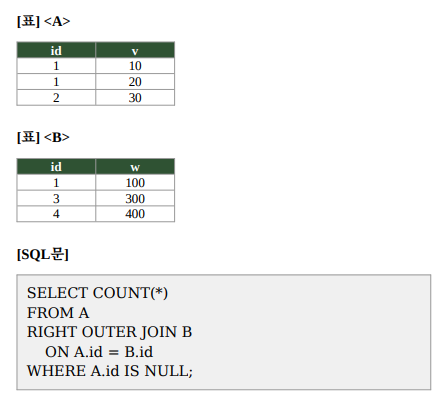

# 문제 14

## 문제

다음 A·B 테이블과 SQL문을 실행했을 때 결과값을 구하시오.

<strong>정답 보기</strong>

2

<strong>상세 해설</strong>

## 핵심 개념

RIGHT OUTER JOIN은 오른쪽 테이블의 모든 행을 보존한다. 왼쪽 테이블에서 일치 행이 없으면 왼쪽 칼럼은 NULL로 채워진다.

## 문제 풀이

B의 id는 1, 3, 4다. A에는 id=1 행은 있지만 id=3과 id=4 행은 없다. 따라서 `A.id IS NULL`인 결과 행은 두 개이며 COUNT 값은 2다.

## 오답 및 혼동 포인트

A의 중복 id=1 행은 조인 결과에 포함되지만 `A.id IS NULL` 조건에서 제외된다. RIGHT JOIN의 오른쪽은 B이므로 B의 미일치 행이 결과에 남는다.

## 암기 포인트

RIGHT JOIN은 오른쪽 테이블을 보존하고, 반대편 칼럼 IS NULL이면 미일치 행을 고른다.

---
