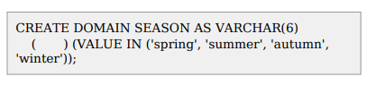

# 문제 19 — SQL 도메인 CHECK 제약

## 문제

다음 SQL문에서 SEASON 도메인의 입력값을 봄·여름·가을·겨울로 제한하기 위해 괄호에 들어갈 키워드를 쓰시오.

## 정답

CHECK

<strong>상세 해설</strong>

## 핵심 개념

CHECK 제약 조건은 칼럼이나 도메인에 저장할 수 있는 값이 지정한 논리 조건을 만족하도록 제한한다.

## 문제 풀이

문제의 `VALUE IN ('spring', 'summer', 'autumn', 'winter')`처럼 허용 값 집합을 명시하는 키워드는 CHECK다.

## 오답 및 혼동 포인트

DEFAULT는 기본값을 지정하고, NOT NULL은 NULL 입력을 막는다. 참조 무결성 제약은 FOREIGN KEY로 선언한다. 허용 목록을 검사하는 역할은 CHECK가 맡는다.

## 암기 포인트

허용 값·범위를 검사하는 도메인 조건은 CHECK로 선언한다.

---

출처: [Life-Journey, 2026년 2회 정보처리기사 실기 복원 문제](https://chobopark.tistory.com/562) (원문에 CC BY 4.0 저작자표시 링크 표시)
