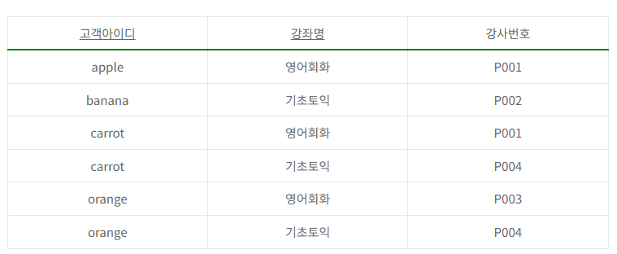

# 문제 20 — 제3정규형 관계 판별

## 문제

다음 표가 나타내는 정규형을 쓰시오.

## 정답

제3정규형 (3NF)

<strong>상세 해설</strong>

## 핵심 개념

제3정규형은 제2정규형을 만족하면서 비주요 속성이 후보키에 이행적으로 종속되지 않도록 한다. 정규형 판단은 값이 반복되는지보다 속성 간 함수 종속과 후보키를 기준으로 한다.

## 문제 풀이

표의 고객아이디와 강좌명 조합이 수강 행을 식별하는 복합 키로 해석된다. 강사번호는 이 조합에 종속되고, 제시된 구조에서는 부분 종속이나 비주요 속성 사이의 이행 종속이 나타나지 않아 원문 정답인 제3정규형으로 분류한다.

## 오답 및 혼동 포인트

같은 강좌명이나 강사번호가 여러 번 보인다는 사실만으로 정규형 위반이라고 판단하지 않는다. 복합 키 중 일부에만 비주요 속성이 종속되면 2NF 위반이고, 비주요 속성을 거쳐 키에 종속되면 3NF 위반이다.

## 암기 포인트

정규형은 중복 행의 모양이 아니라 후보키와 함수 종속 관계를 기준으로 판별한다.

---
