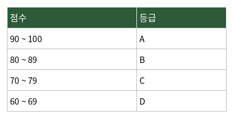

# 문제 1

## 문제

다음은 블랙박스 테스트 기법에 대한 설명이다. 괄호 (   ) 안에 들어갈 말을 보기에서 골라 쓰시오.

(   )은 프로그램의 입력 조건을 유효한 값과 유효하지 않은 값의 영역으로 나누고, 각 영역을 대표할 수 있는 값을 선정하여 테스트 케이스를 설계하는 명세 기반(블랙박스) 테스트 기법이다.

위 표에서 테스트 값으로 60을 입력하였을 때, 예상 결과와 실제 결과가 모두 등급 D로 일치하였다. 이는 (   ) 기법을 적용하여 각 등급 구간의 대표값을 테스트한 사례이다.

### 보기

1. 동치분할 (Equivalence Partitioning)
2. 경계값분석 (Boundary Value Analysis)
3. 결정테이블 테스트 (Decision Table Testing)
4. 상태전이 테스트 (State Transition Testing)

---

<strong>정답</strong>

ㄱ. 동치분할 (Equivalence Partitioning)

<strong>해설</strong>

## 1. 문제에서 묻는 핵심

입력값을 성질이 같은 영역으로 나누고 각 영역을 대표하는 값을 골라 테스트하는 블랙박스 테스트 기법을 묻는다.

## 2. 개념 이해

**동치 분할(Equivalence Partitioning)**은 입력 조건을 유효한 영역과 유효하지 않은 영역 또는 서로 다른 처리 영역으로 나누고, 각 영역을 대표하는 값을 선택하여 테스트하는 기법이다. 모든 값을 하나씩 시험하는 대신 같은 방식으로 처리될 것으로 예상되는 값들을 묶어 테스트한다.

**경계값 분석(Boundary Value Analysis)**은 이와 달리 각 영역의 경계와 경계 주변 값을 집중적으로 테스트한다.

## 3. 문제 풀이

표에서는 90~100, 80~89, 70~79, 60~69처럼 점수 구간이 나뉘어 있다. 60은 60~69라는 D 구간을 대표하는 값으로 사용되었다.

따라서 문제에서 말하는 '각 등급 구간의 대표값을 테스트'한다는 설명은 동치 분할의 핵심과 일치한다.

## 4. 보기별 분석

- **ㄱ. 동치분할**: 입력 영역을 나누고 각 영역의 대표값을 선택하므로 정답이다.
- **ㄴ. 경계값분석**: 경계 또는 경계 주변의 값을 중심으로 테스트한다.
- **ㄷ. 결정테이블 테스트**: 여러 조건의 조합과 그에 따른 결과를 표로 만들어 테스트한다.
- **ㄹ. 상태전이 테스트**: 시스템의 상태와 상태 사이의 전이를 기준으로 테스트한다.

## 5. 핵심 정리

동치 분할은 **'영역을 나누고 대표값을 선택'**하는 기법이다.

## 6. 암기 포인트

**동치 = 같은 성질끼리 묶기**, **경계값 = 경계 주변 확인**으로 기억하면 두 기법을 쉽게 구분할 수 있다.

