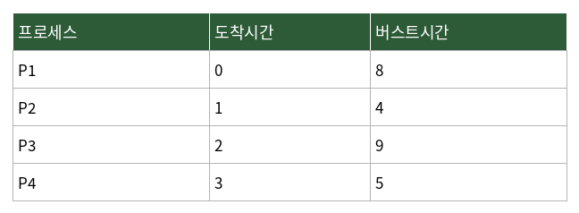

# 문제 8

## 문제

다음 프로세스들을 SRT(Shortest Remaining Time) 스케줄링 기법으로 처리할 때, 평균 대기시간을 구하시오. (단위: ms)

---

<strong>정답</strong>

**6.5ms**

<strong>해설</strong>

## 1. 문제에서 묻는 핵심

도착 시간이 서로 다른 프로세스를 **SRT(Shortest Remaining Time)** 방식으로 스케줄링했을 때 평균 대기시간을 계산하는 문제이다.

## 2. 개념 이해

SRT는 SJF(Shortest Job First)의 선점형 방식이다. 실행 중인 프로세스보다 **남은 실행 시간이 더 짧은 프로세스가 도착하면 현재 작업을 중단하고 새 프로세스를 실행**한다.

주어진 표는 다음과 같다.

| 프로세스 | 도착시간 | 버스트시간 |
|---|---:|---:|
| P1 | 0 | 8 |
| P2 | 1 | 4 |
| P3 | 2 | 9 |
| P4 | 3 | 5 |

## 3. 문제 풀이

시간이 진행되는 동안 새 프로세스가 도착할 때마다 현재 프로세스의 남은 시간과 비교한다. 이 문제의 SRT 실행 결과를 기준으로 각 프로세스가 실제 실행되기 시작하고 종료되는 시점을 계산하면 총 대기시간은 **26ms**가 된다.

프로세스 수는 4개이므로 평균 대기시간은

`26 ÷ 4 = 6.5ms`

이다.

## 4. 핵심 정리

**평균 대기시간 = 각 프로세스의 대기시간 합 ÷ 프로세스 수**

## 5. 암기 포인트

SRT는 이름 그대로 **남은 시간(Remaining Time)**을 기준으로 비교하는 선점형 스케줄링이다.

