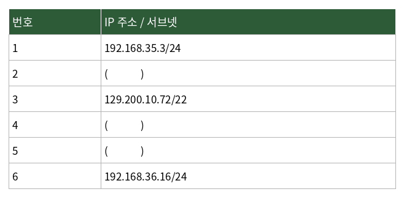

# 문제 10

## 문제

다음은 네트워크 A, B, C에 속한 호스트의 IP 주소 목록이다. 괄호 안에 들어갈 수 있는 IP 주소를 각각 하나씩 쓰시오.

---

<strong>정답</strong>

2. `192.168.35.72`  
4. `129.200.8.249`  
5. `192.168.36.249`

<strong>해설</strong>

## 1. 문제에서 묻는 핵심

주어진 IP 주소와 서브넷 프리픽스를 이용해 같은 네트워크에 속할 수 있는 호스트 주소를 찾는 문제이다.

## 2. 개념 이해

CIDR 표기 `/24`, `/22`는 IP 주소에서 네트워크 부분의 비트 수를 나타낸다.

- `/24` → 앞의 24비트가 네트워크 부분
- `/22` → 앞의 22비트가 네트워크 부분

같은 서브넷에 속하려면 해당 네트워크 범위 안의 **사용 가능한 호스트 주소**를 선택해야 한다. 네트워크 주소와 브로드캐스트 주소는 일반적인 호스트 주소로 사용할 수 없다.

## 3. 문제 풀이

원문의 표에는 다음 기준 주소가 주어진다.

- `192.168.35.3/24`
- `129.200.10.72/22`
- `192.168.36.16/24`

이를 각각의 네트워크 범위와 비교하여 빈칸에 들어갈 수 있는 호스트 주소를 판단하면 원문 정답은 다음과 같다.

- 2번 → `192.168.35.72`
- 4번 → `129.200.8.249`
- 5번 → `192.168.36.249`

## 4. 핵심 정리

CIDR에서 `/n`은 네트워크 부분의 비트 수이다. 같은 네트워크인지 판단할 때는 **네트워크 주소와 호스트 범위**를 함께 확인해야 한다.

## 5. 암기 포인트

`/24`는 마지막 옥텟이 호스트 영역이고, `/22`처럼 프리픽스가 줄어들면 여러 /24 범위를 포함할 수 있다.

