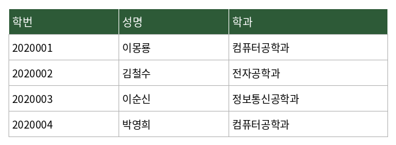
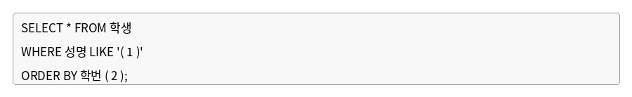

# 문제 12

## 문제

다음 <학생> 테이블에서 성이 '이'씨인 학생의 정보를 조회하되, 학번을 기준으로 내림차순 정렬하여 출력하고자 한다. SQL문의 괄호 안에 들어갈 알맞은 내용을 각각 쓰시오.

---

<strong>정답</strong>

1. `이%`  
2. `DESC`

<strong>해설</strong>

## 1. 문제에서 묻는 핵심

SQL의 `LIKE` 패턴과 `ORDER BY`의 정렬 방향을 묻는다.

## 2. 개념 이해

`LIKE`는 문자열이 특정 패턴과 일치하는지 검색한다.

`%`는 길이에 관계없이 **0개 이상의 임의의 문자열**을 의미한다. 따라서 `이%`는 '이'로 시작하는 모든 문자열을 찾는다.

`ORDER BY`에서 `DESC`는 내림차순(Descending), `ASC`는 오름차순(Ascending)을 의미한다.

## 3. 문제 풀이

성이 '이'씨인 학생은 이름이 '이'로 시작하므로 `LIKE '이%'`를 사용한다.

학번을 기준으로 **내림차순** 정렬하라고 했으므로 `ORDER BY 학번 DESC`가 된다.

## 4. 핵심 정리

- `LIKE '이%'` → '이'로 시작
- `%` → 0개 이상의 임의 문자열
- `DESC` → 내림차순
- `ASC` → 오름차순

## 5. 암기 포인트

`%`는 **여러 글자**, `_`는 **한 글자**의 와일드카드라고 기억한다.

