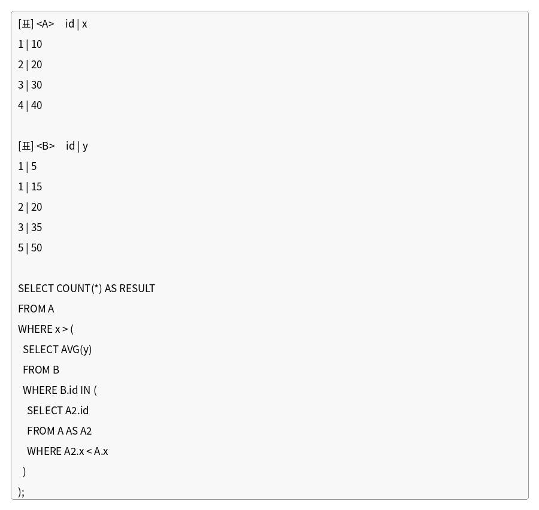

# 문제 13

## 문제

다음 <A>, <B> 테이블과 SQL문을 참고하여, SQL문을 실행했을 때 출력되는 RESULT 값을 구하시오.

---

<strong>정답</strong>

`3`

<strong>해설</strong>

## 1. 문제에서 묻는 핵심

상관 서브쿼리와 `AVG()`를 이해하고, 각 A 행마다 조건을 다시 계산해야 하는 SQL 문제이다.

## 2. 개념 이해

SQL의 서브쿼리가 바깥 쿼리의 현재 행을 참조하면 **상관 서브쿼리(Correlated Subquery)**가 된다.

이 문제에서는 바깥쪽 A의 `x`를 안쪽의 `A2.x < A.x`가 참조한다. 따라서 A의 각 행마다 안쪽 평균이 달라질 수 있다.

## 3. 문제 풀이

A는 `(1,10), (2,20), (3,30), (4,40)`이다.

각 A 행에 대해 `A2.x < A.x`인 A2의 id를 찾고, B에서 해당 id들의 y 평균을 계산한다.

- A.x=10 → A2.x<10인 행이 없음 → 조건을 만족하지 못함
- A.x=20 → id 1 → B의 y는 5, 15 → 평균 10 → `20 > 10` 참
- A.x=30 → id 1,2 → y는 5,15,20 → 평균 40/3 → `30 > 40/3` 참
- A.x=40 → id 1,2,3 → y는 5,15,20,35 → 평균 18.75 → `40 > 18.75` 참

따라서 조건을 만족하는 A의 행은 3개이다.

## 4. 핵심 정리

상관 서브쿼리는 **바깥 행이 바뀔 때마다 안쪽 쿼리의 조건도 달라질 수 있다.**

## 5. 암기 포인트

`A2.x < A.x`처럼 안쪽 별칭이 바깥 별칭을 참조하면 상관 서브쿼리인지 먼저 확인한다.

