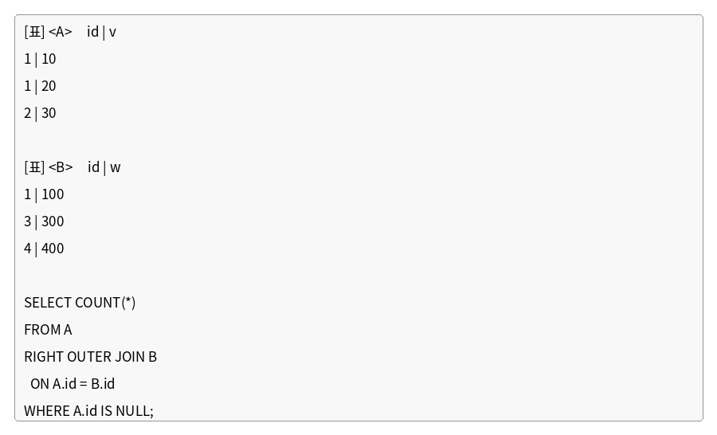

# 문제 14

## 문제

다음 <A>, <B> 테이블과 SQL문을 참고하여, SQL문을 실행했을 때 출력되는 결과값을 구하시오.

---

<strong>정답</strong>

`2`

<strong>해설</strong>

## 1. 문제에서 묻는 핵심

`RIGHT OUTER JOIN`과 `NULL` 조건을 이용해 어느 행이 결과에 남는지 판단하는 문제이다.

## 2. 개념 이해

`RIGHT OUTER JOIN`은 오른쪽 테이블인 B의 **모든 행을 보존**한다. A와 일치하는 행이 없으면 A의 컬럼에는 `NULL`이 들어간다.

따라서 `WHERE A.id IS NULL`은 B에는 존재하지만 A에는 대응 행이 없는 경우를 찾는 조건이다.

## 3. 문제 풀이

B의 id는 `1, 3, 4`이다.

A의 id는 `1, 1, 2`이다.

- B.id=1 → A.id=1과 일치 → A.id는 NULL이 아님
- B.id=3 → A에 없음 → A.id가 NULL
- B.id=4 → A에 없음 → A.id가 NULL

따라서 조건을 만족하는 행은 2개이다.

## 4. 핵심 정리

`RIGHT OUTER JOIN`에서는 오른쪽 테이블이 기준이 된다. 오른쪽에는 있지만 왼쪽에 대응 행이 없으면 왼쪽 컬럼이 `NULL`이 된다.

## 5. 암기 포인트

**RIGHT = 오른쪽 테이블 보존**, **LEFT = 왼쪽 테이블 보존**으로 기억한다.

