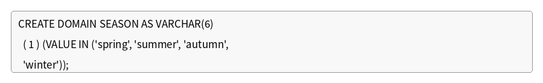

# 문제 19

## 문제

다음은 SEASON이라는 도메인을 정의하면서, 입력 가능한 값을 봄/여름/가을/겨울로 제한하는 SQL문이다. 괄호 안에 들어갈 알맞은 키워드를 쓰시오



---
<details>
<summary><strong>정답</strong></summary>

CHECK

</details>

<details>
<summary><strong>해설</strong></summary>

## 1. 문제에서 묻는 핵심

SQL에서 도메인이나 컬럼에 입력될 수 있는 값을 조건으로 제한하는 제약 조건을 묻는다.

## 2. 개념 이해

`CHECK` 제약 조건은 데이터가 특정 조건을 만족하는지 검사한다.

문제의 SQL은 다음과 같은 구조이다.

```sql
CREATE DOMAIN SEASON AS VARCHAR(6)
  CHECK (VALUE IN ('spring', 'summer', 'autumn', 'winter'));
```

`VALUE IN (...)`은 입력되는 값이 괄호 안에 나열된 값 중 하나인지 검사한다.

## 3. 문제 풀이

문제에서 '입력 가능한 값을 봄/여름/가을/겨울로 제한'한다고 했다. 이는 특정 조건을 만족하는 값만 허용해야 하므로 `CHECK` 제약 조건을 사용한다.

## 4. 핵심 정리

`CHECK` = **지정한 조건을 만족하는 데이터만 허용**

## 5. 암기 포인트

- `PRIMARY KEY` → 기본키
- `FOREIGN KEY` → 외래키
- `UNIQUE` → 중복 방지
- `CHECK` → 조건 제한

</details>
