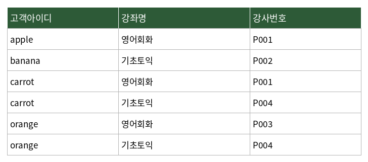

# 문제 20

## 문제

아래 표에서 나타나고 있는 정규형을 작성하시오

---

<strong>정답</strong>

제 3정규형

<strong>해설</strong>

## 1. 문제에서 묻는 핵심

주어진 관계 테이블이 어느 정규형에 해당하는지를 판단하는 문제이다.

## 2. 개념 이해

데이터베이스 정규화는 데이터의 중복과 이상 현상을 줄이기 위해 테이블을 적절한 구조로 분해하는 과정이다.

대표적으로 다음과 같은 단계가 있다.

- **1NF**: 모든 속성값이 원자값이어야 한다.
- **2NF**: 1NF를 만족하면서 부분 함수 종속을 제거한다.
- **3NF**: 2NF를 만족하면서 이행적 함수 종속을 제거한다.

## 3. 문제 풀이

표는 `고객아이디`, `강좌명`, `강사번호`로 구성되어 있으며 각 행에는 하나의 고객-강좌 조합과 그에 대응하는 강사번호가 기록되어 있다.

이 문제에서 제시된 표는 원문 정답 기준으로 **제3정규형**에 해당한다.

제3정규형을 판단할 때는 단순히 값이 중복되는지 보는 것이 아니라, 기본키와 함수적 종속 관계를 기준으로 부분 함수 종속과 이행적 함수 종속이 존재하는지를 확인해야 한다.

## 4. 핵심 정리

정규형의 핵심 흐름은 다음과 같다.

`1NF → 2NF → 3NF`

1NF는 원자값, 2NF는 부분 함수 종속 제거, 3NF는 이행적 함수 종속 제거가 핵심이다.

## 5. 암기 포인트

**1NF = 원자값**, **2NF = 부분 함수 종속 제거**, **3NF = 이행적 함수 종속 제거**로 연결해서 기억한다.

